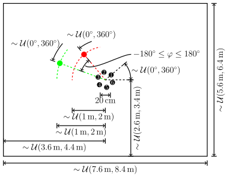

# SMS-WSJ: A database for in-depth analysis of multi-channel source separation algorithms



This repository includes the scripts required to create the SMS-WSJ database, a spatial clustering baseline for separation,
and a baseline ASR system using Kaldi (http://github.com/kaldi-asr/kaldi).

## Why does this database exist?

In multi-speaker ASR the [WSJ0-2MIX database](https://www.merl.com/demos/deep-clustering) and the spatialized version thereof are widely used.
Observing that research in multi-speaker ASR is often hard to compare because some researchers pretrain on WSJ, while others train only on WSJ0-2MIX or create other sub-lists of WSJ we decided to use a fixed file list which is suitable for training an ASR system without additional audio data.
Punctuation pronunciation utterances are filtered to further facilitate end-to-end ASR experiments.

Further, we argue that the tooling around [WSJ0-2MIX database](https://www.merl.com/demos/deep-clustering) and the spatialized version thereof is very limited.
Therefore, we provide a spatial clustering baseline and a Kaldi ASR baseline.
Researchers can now easily improve parts of the pipeline while ensuring that they can fairly compare with baseline results reported in the associated Arxiv paper.

## How can I cite this work? Where are baseline results?
The associated paper can be found here: https://arxiv.org/abs/1910.13934
If you are using this code please cite the paper as follows:

```
@Article{SmsWsj19,
  author    = {Drude, Lukas and Heitkaemper, Jens and Boeddeker, Christoph and Haeb-Umbach, Reinhold},
  title     = {{SMS-WSJ}: Database, performance measures, and baseline recipe for multi-channel source separation and recognition},
  journal   = {arXiv preprint arXiv:1910.13934},
  year      = {2019},
}
```

## Installation

Does not work with Windows.

Clone this repository and install the package:
```bash
$ git clone https://github.com/fgnt/sms_wsj.git
$ cd sms_wsj
$ pip install --user -e ./
```

Set your KALDI_ROOT environment variable:
```bash
$ export KALDI_ROOT=/path/to/kaldi
```
We assume that the Kaldi WSJ baseline has been created with the `run.sh` script.
This is important to be able to use the Kaldi language model.
To build the ASR baseline the structures created during the first stage of
the `run.sh` script are required.
The ASR baseline uses the language models created during the same stage.
Afterwards you can create the database:
```bash
$ make WSJ_DIR=/path/to/wsj SMS_WSJ_DIR=/path/to/write/db/to
```
If desired the number of parallel jobs may be specified using the additonal
input num_jobs. Per default `nproc --all` parallel jobs are used.


The RIRs are downloaded by default, to generate them yourself see [here](#q-i-want-to-generate-the-rirs-myself-how-can-i-do-that).


Use the following command to train the baseline ASR model:
```bash
$ python -m sms_wsj.train_baseline_asr with egs_path=$KALDI_ROOT/egs/ json_path=/path/to/sms_wsj.json
```
The script has been tested with the KALDI Git hash "7637de77e0a77bf280bef9bf484e4f37c4eb9475"


## Properties

 - Simulated
 - Two speaker mixtures
   - 33561 train, 982 dev and 1332 test mixtures
   - Longest speaker utterance determines mixture length:
     - ASR on both speakers possible
 - WSJ based: As clean utterances WSJ0 and WSJ1 are used.
 - Sample rate: 8 kHz
 - Reverberated
   - RIR generator: [Habets](https://github.com/ehabets/RIR-Generator). We use
     [this](https://github.com/boeddeker/rirgen) python port.
   - Random room with 6 microphones, see first image in this README.
   - T60: 200-500 ms
   - Time of Flight (ToF) compensation jointly over all channels without RIR
     truncation
     - A ToF compensation allows to use the source signal as target
       for signal level metrics like BSSEval SDR and PESQ, but it also allows
       the use of ASR alignments for an ASR training.
     - We do not remove the samples in the RIR before the estimated ToF,
       because that would imply, that we assume there is an error in the RIR
       generator.
   - Early-Late split
     - We propose a split of the RIR in the early and late part. In this way
       the early RIR convolved with the speech source can be used as target
       for NN losses (e.g. negative SDR). Note: This is not a target signal
       for metrics, because it is far away from a unique definition (Don't
       modify the target signal if you want to judge your system).
     - Proposed default: 50 ms (Motivated by the REVERB challange)
 - Noise
   - 20-30 dB Additive white Gaussian noise (AWGN)
      - We decided to use just simple noise, because we don't know, how to
        simulate realistic multichannel noise.
        (e.g. a point noise source is unrealistic)
      - We used low volume noise, because it is just AWGN noise.
 - **Each unique utterance exactly equally often**
    - While the utterances that are used to create are randomly chosen,
      we used a sampling algorithm, that guarantees, that each utterance is
      equally often used. This ensures, that the "Word" distribution is exactly
      the same as the distribution of WSJ0 and WSJ1.
    - Many other mixture databases just sample randomly the utterances and
      don't ensure that each utterance appears equally often.
    - Randomization approach can be generalized to more speakers.
 - Random and deterministic
 - Exclude verbalized punctuation

## How to use this database?

Once you installed this repository and created the sms_wsj database,
there are a few ways, how you can use this database:

 - Manually read the files from the filesystem (Recommended, when you don't work with python or don't want to use the provided code)
 - Manually read the json (Not recommended)
 - Use some helper functions from us to:
   - Load all desired files from the disk (Recommended for local file systems)
   - Load only original WSJ utterances and the RIRs and generate the examples on the fly with the help of the json. (Recommended for remote file systems, we mainly use this)
     - This requires some CPU time. It can be done in a backgroud threadpool, e.g. `lazy_dataset.Dataset.prefetch`, for NN experiments, where the CPU often idles, while the GPU is working.
     - This allows dynamic mixing of the examples, e.g. creating a nearly infinitely large training dataset.

On the file system you will find files like `.../<signal_type>/<dataset>/<rir_id>_<1_wsj_id>_<2_wsj_id>[_<utt_index>].wav` (e.g. `.../observation/train_si284/0_4axc0218_01kc020f.wav`).
Here an explanation, how the path and file names are generated:
-  `<signal_type>`:
    - Possible values: `observation`, `speech_source`, `early`, `tail` or `noise`
    - `observation` = `early` + `tail` + `noise`
    - `speech_source`: The padded signal from WSJ (i.e. `original_source`).
    - `early`/`tail`: `speech_source` convolved with inital/late part of `rirs`
    - Note: `speech_image` must be calculated as `early` + `tail`
      - `speech_image` = `early` + `tail` = `speech_source` convolved with `rirs`
    - Note: The WSJ files are mirrored to `wsj_8k_zeromean` and converted to `wav` files and downsamples. Because we simply mirror, the easiest way to find the `original_source` is to use the json.
-  `<dataset>`:
    - Possible values: `train_si284`/`cv_dev93`/`test_eval92`
    - The original WSJ dataset name.
- `<rir_id>`:
    - A running index for the generated room impulse responses (RIR).
- `<1_wsj_id>`, `<2_wsj_id>`:
    - The WSJ utterance IDs that are used to generate the mixture.
- `<utt_index>`:
    - Possible values: `0` and `1`
    - An index, which WSJ utterance/speaker is present in the wav file.
    - Omitted for the observation.

The database creation generates a json file. This file contains all information about the database.
The pattern is as follows:
```python
{
  "datasets": {
    dataset_name: {  # "train_si284", "cv_dev93" or "test_eval92"
      example_id: {  # <rir_index>_<first_speaker_id>_<second_speaker_id>
        "room_dimensions": [[...], [...], [...]]],
        "sound_decay_time": ...,
        "source_position": [[..., ...], [..., ...], [..., ...]]
        "sensor_position": [[..., ..., ..., ..., ..., ...], [..., ..., ..., ..., ..., ...], [..., ..., ..., ..., ..., ...]],
        "example_id": "...",
        "num_speakers": 2,
        "speaker_id": ["...", "..."],
        "gender": ["...", "..."],  # "male" or "female"
        "kaldi_transcription": ["...", "..."],
        "log_weights": [..., ...],  # weights of utterances before the are added
        "num_samples": {
          "original_source": [..., ...],
          "observation": ...,
        },
        "offset": [..., ...]  # Offset of utterance start in samples
        "snr": ...,
        "audio_path": {
          "original_source": ["...", "..."],
          "speech_source": ["...", "..."],
          "rir": ["...", "..."],
          "speech_reverberation_early": ["...", "..."],
          "speech_reverberation_tail": ["...", "..."],
          "noise_image": "...",
          "observation": "...",
        }
      }
    }
  }
}
```
This file can be used to get all details for each example.
To read it with python, we have some helper functions:
<!-- To access one (or multiple) examples, you can use the following setup code: -->

```python
from sms_wsj.database import SmsWsj, AudioReader
db = SmsWsj(json_path='.../sms_wsj.json')
ds = db.get_dataset('train_si284')  # "train_si284", "cv_dev93" or "test_eval92"
ds = ds.map(AudioReader((
    'observation',
    'speech_source',
    # 'original_source',
    # 'speech_reverberation_early',
    # 'speech_reverberation_tail',
    'speech_image',
    # 'noise_image',
    # 'rir',
)))
```

Now you can access the examples with the dataset instance.
You can iterate over the dataset (e.g. `for example in ds: ...`) or access examples by their ID, e.g. `ds['0_4axc0218_01kc020f']`
(Access with an index (e.g. `ds[42]`) only works, when the dataset is not shuffled.).
The audio files, that are requested from the `AudioReader` will be loaded on demand and will be available under the key `audio_data` in the `example`.

If you want to reduce the IO, you can use the `scenario_map_fn`:
```python
from sms_wsj.database import SmsWsj, AudioReader, scenario_map_fn
db = SmsWsj(json_path='.../sms_wsj.json')
ds = db.get_dataset('cv_dev93')  # "train_si284", "cv_dev93" or "test_eval92"
ds = ds.map(AudioReader((
    'original_source',
    'rir',
)))
ds = ds.map(scenario_map_fn)  # Calculates all signals from `original_source` and `RIR`
```
This will avoid the reading of the multi channel signals.
Since the `scenario_map_fn` calculates the convolutions, it can be usefull to use the `prefetch`, so the convolution is done in the backgroud
(Note: The [GIL](https://en.wikipedia.org/wiki/Global_interpreter_lock) will be released, so a ThreadPool is enough.).

The last option, that we provide, is dynamic mixing.
With each iteration over the dataset, you will get a different utterance.
The `rir` will always be the same, but the utterances will differ (The simulation of the RIR is too expensive to do it on demand):
```python
from sms_wsj.database import SmsWsj, AudioReader, scenario_map_fn
from sms_wsj.database.dynamic_mixing import SMSWSJRandomDataset
db = SmsWsj(json_path='.../sms_wsj.json')
ds = db.get_dataset('train_si284')
ds = SMSWSJRandomDataset(ds)
ds = ds.map(AudioReader((
    'original_source',
    'rir',
)))
ds = ds.map(scenario_map_fn)  # Calculates all signals from `original_source` and `RIR`
```

Once you have a `Dataset` instance, you can perfrom shuffeling, batching (with a collate function) and prefetching with a thead/process pool:

```python
ds = ds.shuffle(reshuffle=True)
ds = ds.batch(batch_size)  # Create a list from `batch_size` consecutive examples
ds = ds.map(my_collate_fn)  # e.g. sort the batch, pad/cut examples, move outer list to batch axis, ...
ds = ds.prefetch(4, 8)  # Use a ThreadPool with 4 threads to prefetch examples
```

## FAQ
### Q: How large is the disc capacity required for the database?
A: The total disc usage is 442.1 GiB.  

directory         | disc usage
:------------------|--------------:
tail              |      120.1 GiB  
early             |      120.1 GiB  
observation       |      60.0 GiB  
noise             |      60.0 GiB  
rirs              |      52.6 GiB  
wsj_8k_zeromean   |      29.2 GiB  
sms_wsj.json      |      139,7 MiB  
wsj_8k.json       |      31,6 MiB  

### Q: How many hours takes the database creation?
A: Using 32 cores the database creation without recalculating the RIRs takes around 4 hours.

### Q: What does the example ID `0_4k6c0303_4k4c0319` mean?
A: The example ID is a unique identifier for an example (sometime also known as utterance ID).
The example ID is a composition of the sperakers, the utterances and an scenario counter:


=======

### Q: What to do if Kaldi uses Python 3 instead of Python 2?
The Python code in this repository requires Python 3.6. However, Kaldi runs
on Python 2.7. To solve this mismatch Kaldi has to be forced to switch the
Python version using the `path.sh`. Therefore, add the follwing line to
the `${KALDI_ROOT}/tools/envh.sh` file:
```
export PATH=path/to/your/python2/bin/:${PATH}
```

### Q: I want to generate the RIRs myself. How can I do that?
To generate the RIRs you can run the following command:
```bash
$ mpiexec -np $(nproc --all) python -m sms_wsj.database.create_rirs with database_path=cache/rirs
```
The expected runtime will be around `1900/(ncpus - 1)` hours.
When you have access to an HPC system, you can replace `mpiexec -np $(nproc --all)` with an HPC command.
It is enough, when each job has access to 2GB RAM.
